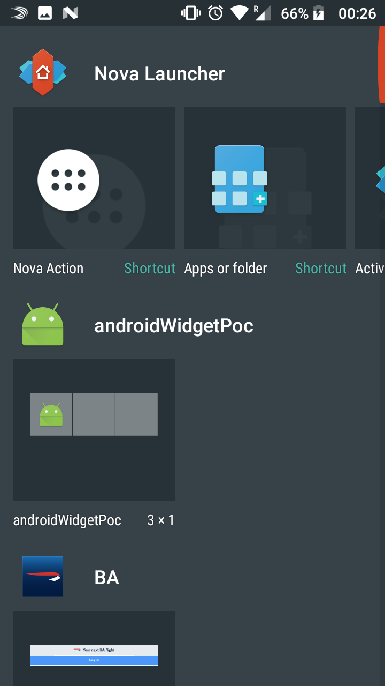
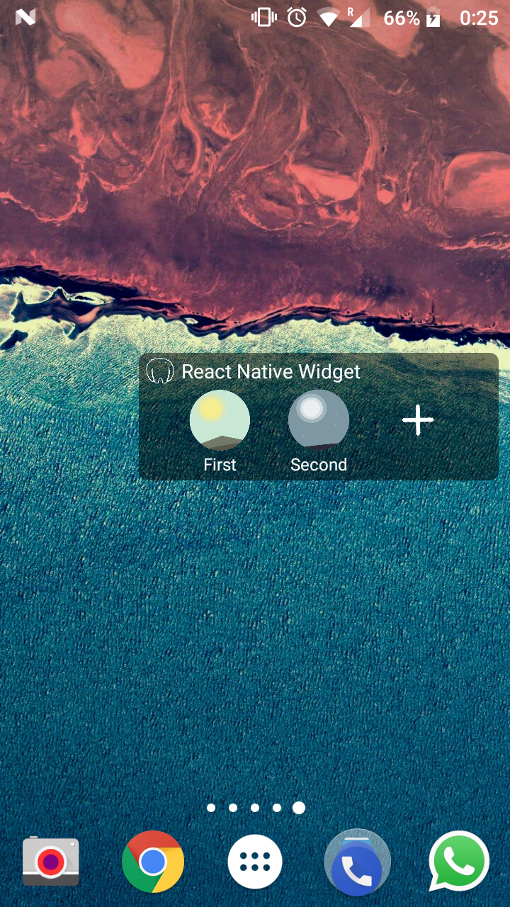
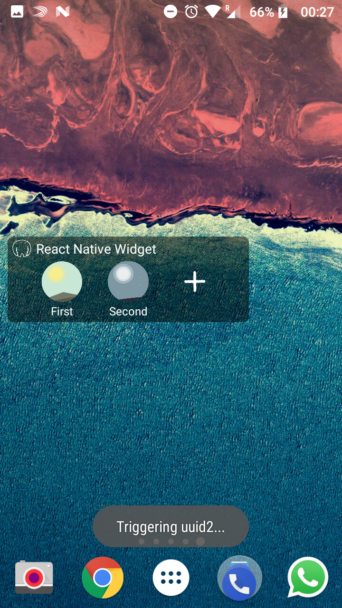
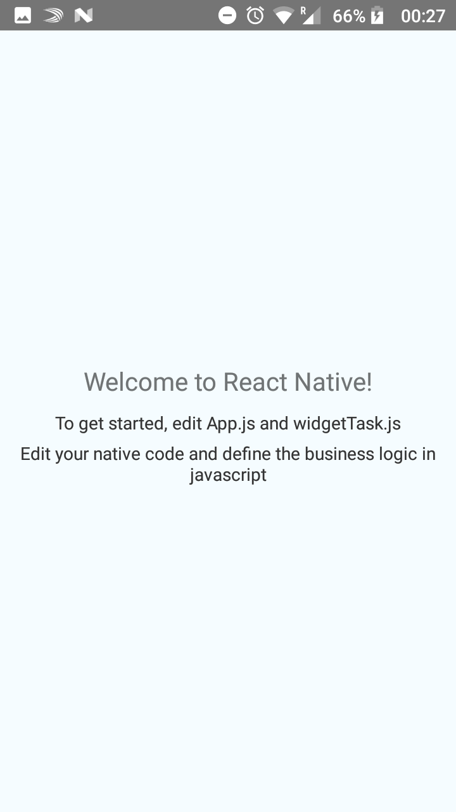

# React Native Android Widget Proof Of Concept

:robot: Using React Native and having Android widgets is possible.

1. Create buttons in Java / Android XML to triggers intents
2. Process these intents from the Javascript side with all the tools and flexibility
from react-native.

> It is a bit complicated, and we developed it with little knowledge of Android in the beginnings, so I apologize if it feels bad designed.
> 🚧  Please help us improve the strategy / code layout with Pull Requests.

## Try
```bash
git clone https://github.com/jsdario/react-native-android-widget-poc
cd react-native-android-widget-poc
npm install # or yarn install
react-native link react-native-background-timer # to avoid the main thread
react-native run-android
```

### Demo






To build your own Android Widget, use this project to bootstrap the widget and hack upon or replicate the strategy to make it work.

## How it works
It consists in several Android and React Native concepts. Please read with eskepticism, other formulas may be simpler.
* Your React Native app, bundles all the JS, even the one
corresponding to your widget and services. It is the main [Activity](https://developer.android.com/reference/android/app/Activity.html) of the Android realm.
* A [WidgetProvider](https://developer.android.com/reference/android/appwidget/AppWidgetProvider.html) is meant to render the view onto your Android desktop and also to listen for the events (button presses) that will be sent to your app. It is then, a Broadcast receiver that can process in Java different intents, before it reaches the JS side.
* A [Headless JS task](https://facebook.github.io/react-native/docs/headless-js-android.html) is the React Native approach to an Android Service. This part will process the intents (events) coming from your WidgetProvider.
* A custom [Native Module](https://facebook.github.io/react-native/docs/native-modules-android.html) is used to bridge the JS realm with the AppWidgetProvider.

If you take a look at the AndroidManifest.xml you can see how the Android relevant parts are declared to the system:
```diff
<manifest 
    xmlns:android="http://schemas.android.com/apk/res/android" package="com.androidwidgetpoc" android:versionCode="1" android:versionName="1.0">
    <uses-permission android:name="android.permission.INTERNET" />
    <uses-permission android:name="android.permission.SYSTEM_ALERT_WINDOW"/>
+   <uses-permission android:name="android.permission.WAKE_LOCK" />
    <uses-sdk android:minSdkVersion="16" android:targetSdkVersion="22" />
    <application android:name=".MainApplication" android:allowBackup="true" android:label="@string/app_name" android:icon="@mipmap/ic_launcher" android:theme="@style/AppTheme">
        <activity android:name=".MainActivity" android:label="@string/app_name" android:configChanges="keyboard|keyboardHidden|orientation|screenSize" android:windowSoftInputMode="adjustResize">
            <intent-filter>
                <action android:name="android.intent.action.MAIN" />
                <category android:name="android.intent.category.LAUNCHER" />
            </intent-filter>
        </activity>
        <activity android:name="com.facebook.react.devsupport.DevSettingsActivity" />
+        <receiver android:name="WidgetProvider">
+            <intent-filter>
+                <action android:name="android.appwidget.action.APPWIDGET_UPDATE" />
+            </intent-filter>
+            <intent-filter>
+                <action android:name="com.androidwidgetpoc.CHARM_1" />
+                <action android:name="com.androidwidgetpoc.CHARM_2" />
+                <action android:name="com.androidwidgetpoc.CHARM_3" />
+            </intent-filter>
+            <meta-data android:name="android.appwidget.provider" android:resource="@xml/widgetprovider" />
+        </receiver>
+        <service android:name=".BackgroundTask" android:enabled="true" android:label="BackgroundAdd" />
    </application>
</manifest>
``` 

A step by step guide on how we got here:
1. We prepared a Headless JS [widgetTask.js](widgetTask.js) to run in the as the declared service of [BackgroundTask.java](android/app/src/main/java/com/androidwidgetpoc/BackgroundTask.java). We started using Android Studio heavily from this point.
2. We created a Native Module to layout and print a Widget, so [BackgroundTaskBridge.java](android/app/src/main/java/com/androidwidgetpoc/BackgroundTaskBridge.java) and [BackgroundTaskBridgePackage.java](android/app/src/main/java/com/androidwidgetpoc/BackgroundTaskBridgePackage.java) were born, along with the [layout folder](android/app/src/main/res/layout).
3. The [WidgetProvider](android/app/src/main/java/com/androidwidgetpoc/WidgetProvider.java) became necessary as a proxy between the intents generated by the Widget layout (rendered thanks to the `BackgroundTaskBridge`) and the actual calls to the `widgetTask` service.
4. Refined and serialised the messages between all the interfaces.

The hardest part? The whole JS bundle has to be running in a context for the widgetTask to run valid code. In this proof of concept app it's real quick and simple, but it can lead to huge inconsistencies if you need to pull some data from a remote or read from `AsyncStorage`. Be patient. Use redux or other state management to ensure the conditions you want to be running on.

### Can I create widgets _views_ using React Native instead of Java?
We haven't done this, but we belive that from this point has to be much easier,
having the strategy laid down, we'd need to create [Native UI Components](https://facebook.github.io/react-native/docs/native-components-android.html)
calling methods from the `RemoteView` class and context instead of the `View` class.
It is not trivial to us, though.


<a href="https://getyeti.co" target="_blank">
   
</a>

> This proof of concept is applied at [Yeti Smart Home](https://getyeti.co) and is used in production. Some of the art is also produced at Netbeast. Follow us in Github or [Twitter](https://twitter.com/netbeast_co).